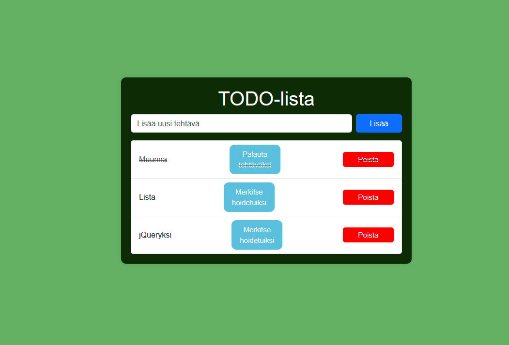

# jsprj3# Project Title 
TODO-lista, Paavo Koivistoinen

## Demo link:
Sivulle pääsee tästä [todolistav2](https://todolistav2.netlify.app)

## How was the workload divided
Tein itse vanhan sovelluksen pohjalta

## Table of Content:

- [About The App](#about-the-app)
- [Screenshots](#screenshots)
- [Technologies](#technologies)
- [Setup](#setup)
- [Approach](#approach)
- [Status](#status)
- [Credits](#credits)
- [License](#license)

## About The App
TODO-lista on paranneltu versio edellisestä projektista, missä käyttäjä voi lisätä tehtävälistalle asioita mitä hoitaa, ja merkitä niitä tehdyiksi kun ne on saatu tehtyä. Tehtäviä voi nyt liikutella ylös ja alas listalla, ja se sisällyttää hienohkoa animointia tehtäviä lisätessä ja poistattaessa nyt.

## Screenshots 

## Technologies
Käytin tässä HTML, CSS ja JavaScriptiä (jQuery)

## Setup
Voit joko avata linkin ylhäällä olevassa demo-kohdassa, tai ladata tiedostot koneellesi kansioon, ja avata index.html tiedoston selaimessa tai ajamalla ohjelman valitsemassasi koodin muokkaus ohelmassa, kuten VisualStudio Code. Live Server lisäosa VS Codessa on esimerkiksi hyvä tapa avata ohjelma.
## Status
Sovellus on valmis ja julkaistu

## Credits
Käytin tehtävässä w3schoolsin jquery-kirjastoa ja tekoälyä ChatGPT virheiden korjaamiseen ja ideoimiseen.
- [w3schools](https://www.w3schools.com/jquery/jquery_examples.asp)

## License
Example: MIT license @ [paaavooo](LICENSE)
